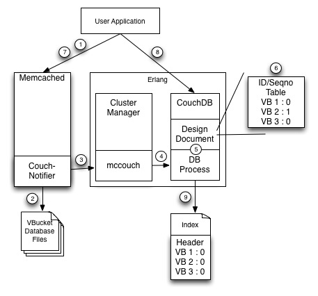

#Indexing (2.x)

The 2.x line of Couchbase added support for a secondary indexing. The indexing feature was added by merging CouchDB style views into the Membase key-value database. This document intends to provide details on how data is passed to the indexer.

When a Couchbase user creates a new bucket the server will initialize all of the neccessary database for this bucket. When this initialization is done each VBucket database files contains a header section that indicates that the highest VBucket By Sequence Number so far is 0. After the user creates a bucket they will likely want to create some indexes on the data that will go into that bucket. To do this they need to create a design document on the bucket and then specify a view function. Once a view is defined Couchbase will create an index file and the index has a header similar to the VBucket databases header. The only difference between the two is that indexes header contains a list of all VBuckets ID/By Sequence Number pairs instead of a single VBuckets ID/By Sequence Number

An index is considered up to date with the database when the high By Sequence Number in each VBucket database file matches the last By Sequence Number for each VBucket in the indexes last written file header. Since after we create a bucket the database files all have 0 as their highest By Sequence Number and the index has 0 as th last seen By Sequence Number for each VBucket we consider the index to be up to date.

Once a bucket is created the user will start adding data to the bucket. In order to demonstrate how data moves from the VBucket databases into the index let's examine what happens when a user does a set on a key, then observes that key for persistence, and then queries the view for that index.

When the user sends a set command to the database they must also observe that the item has been persisted before they can query it. The observe is required because the indexer needs to read items directly from the VBucket database files on disk. Since the indexer and database run in different processes the database needs a way to notify the indexer when there are items that have been added to the database that are not yet in the indexer. This is done through the Couch-Notifier module on the database side and mccouch on the indexer side. During item persistence the Couch-Notifier will notify send a message to mccouch saying that data has been written to a VBucket database file and will tell mccouch what the new highest By Sequence Number is for that file.

When mccouch is notified of a new VBucket ID/By Sequence Number pair it notifies the DB process in erlang which is responsible for making sure that all of the indexes that care about this change are notified. Since we only have one index this notification is passed on to the Design Document whcih keeps an in-memory table of the latest VBucket Id/By Sequence Number pairs. Once this table is updated the notification is complete and the client that observed the set will get a response that the key it set has been persisted.

The client can now submit a view request and since the client wants to see the set it just did in the view it will need to specify the query parameter stale=false. This parameter tells the indexer to index all of the latest changes it has seen up to the point that it receives the query. When the query is received the indexer will compare the in-memory VBucket ID/By Sequence Number pair table with the last VBucket ID/By Sequence Number pairs in the last persisted index header. If the in-memory table shows there have been mutations then the index will open the VBucket database files and read any records that have not been indexed yet. Once all remaining items have been indexed the view will run the query on that index and return the query result back to the client.

####Open Issues

1. The indexer must read from the VBucket database files. This means that any changes to the VBucket database files requires that code must be changed in the indexer too.

2. The indexer must read off of disk in order to index items which is not optimal for the performance of the indexer.

3. The indexer relies on items being in the file system cache in order to make up for the perfomance hit of having to read from disk. This means that the database cannot have a Buffer Manager until the index no longer needs to read from the VBucket database files.

4. Doing scatter gather on indexes is not scalable as the size of the cluster grows. As a result we need a solution that doesn't require the indexer to be on the same node as the database.

5. Front-end operations must wait to be written to disk before they can show up in a query. This impacts performance of customer applications.

???
What happens when we create a design document? When a view is created?