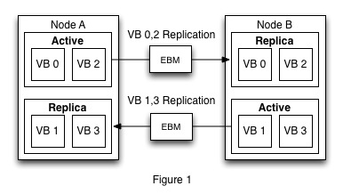
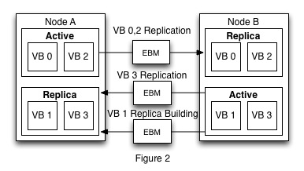

##VBucket Move (Version 2.x)

In order to demonstrate a vbucket takeover in Couchbase let's initially assume that we have a two node cluster with four vbuckets. This cluster is shown with it's replication streams in figure 1 below. The user now decides that they want to remove node B and as a result vbuckets 1 and 3 must be transferred to Node A. In this example let's also assume that the cluster manager is only allowed to move on eVBucket at a time and the cluster manager decides that it will move VBucket 1 first.

In order to do rebalance the cluster manager must first remove VBucket 1 from the replication stream that replicates items from Node B to Node A. It does this by issuing a Change VBucket Filter command to Node B which specifies a new set of VBuckets that should be sent over a given replication stream. In this example the new VBucket filter will only contain VBucket 3. After this command is sent the cluster manager then waits until the command is seen by the process monitoring the replication stream that was changed in order to make sure that the VBucket has successfully been removed from that stream.

After a successful VBucket filter change the cluster manager creates a replication building stream from Node B to Node A for VBucket 1. In our example there are not any replicas because we are going from two nodes to one, but if we did need to create replicas for this VBucket then we would need to create a replica building stream from node B to each node that would contain a replica for VBucket 1. The result of the replica building process is shown in figure 2.

If the replica building process requires backfill then the cluster manager needs to wait until the monitor process sees a message signifying that backfill has completed. If there are multiple replica building streams for a given Vbucket then cluster manager needs to make sure that backfill has completed for each stream before the VBucket move can complete. Once backfill is completed for all of the replica building streams for VBucket 1 the cluster manager will begin doing two things in parallel. Since the majority of the time needed to move a VBucket typically takes place in the backfill phase the cluster manager will start a VBucket move process for the next VBucket (in this case VBucket 3) that needs to be moved. We start this move because a majority of the data for VBucket 1 has already been sent to Node A and we can be confident that we will not be overloading any nodes or overloading the network by starting another VBucket move.

While the next VBucket move happens in the background the cluster manager continues the VBucket move for VBucket 1. Since backfill has completed the cluster manager now needs to get the indexes on Node A and B to be up to date before the  move can complete. To do this the cluster manager will force the creation of a checkpoint on Node B for VBucket 1 and then it will wait until the the forced checkpoint has been persisted on Node A. The cluster manager does this by issueing a Persist Checkpoint command to Node A. This command contains the checkpoint number that the cluster manager wants to have persisted and Node A and the command will not return a response until either the command times out or the checkpoint has been successfully persisted. The reason for doing this is to make sure that a majority of the items that are moved for this VBucket are perisisted to disk and therefore are ready to be indexed. After the items all are on disk the cluster manager will  wait for the indexer on Node A to index all of the items up to the forced checkpoint. This ensures that Vbucket 1 on Node A is close to being up to date with VBucket 1 on Node B.

Now that the indexes are close to being the same we pause indexing and force the creation of a second checkpoint on Node B. The cluster manager then waits until this second forced checkpoint is persisted on Node A and waits for the indexer on Node A to index all of the items up to the second forced checkpoint. This allows the cluster manager to be sure that the index on Node A has seen at least the same mutations as the indexer on Node B. This process is shown on the timeline in Figure 3 below.

Now that the index on Node A has at least the same items as the index on Node B the cluster manager can remove the replica building tap stream and start a VBucket takeover. In order successfully close the replica building stream we must send a no-op mesage in order to make sure that all of the data that is currently on the wire has successfully made it to it's destination. Once the monitor sees the response for the no-op message the cluster manager deregisters the tap connection on Node B (the connection is always killed on the producer side) and create a new tap-takeover connection. This connection will first send a message to change the state of VBucket 1 on Node A from replica to pending and then send any remaining items that haven't been replicated from Node B to Node A. After all remaining items have been sent the tap-takeover stream sets the VBucket on Node B from active to dead state and then again sends over any items that may not have been replicated yet. The items sent here are guaranteed to be the last of the items that need to be sent because a Vbucket in dead state cannot receive any new items. After these items have been processed by Node A another set vbucket message is sent over the tap-takeover stream from Node B to Node A telling Node A to set it's Vbucket state from pending to active and the connection is terminated.

At this point the VBucket has been transferred from Node B to Node A and all that is left to do is for the cluster manager to change the indexer states on Node A and Node B and to update it's cluster map to reflect the VBucket move.

#####Open Issues

1. Vbucket takeover can be a raceful process because the rebalance may fail before the final "set vbucket to active" message is sent over the tap-takeover stream. If this happens then the cluster will be in a state where it is not possible to communicate with a given VBucket because it will be in dead state on one node and in pending state on the other. This issue is currently dealt with by the cluster manager periodically checking to see if this problem has occurred. If it is detected then the cluster manager essentially undo's what the tap-takeover stream has done. This means the dead Vbucket becomes active again and the pending VBucket's state is changed from pending to replica.

2. There is no easy way to kill a tap stream on the consumer side.

3. We need to create a bunch of different tap streams in order to do a VBucket move. Creating an monioring multiple connections adds overhead. It would be nice if we could create on connection an just manipulate what that connection sends.
