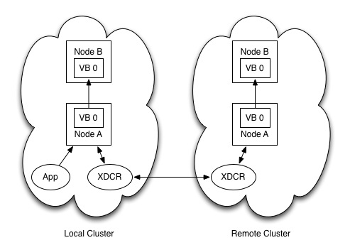
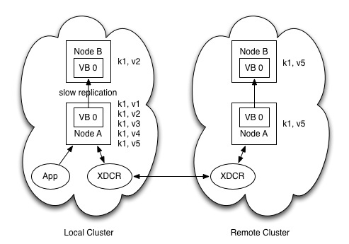
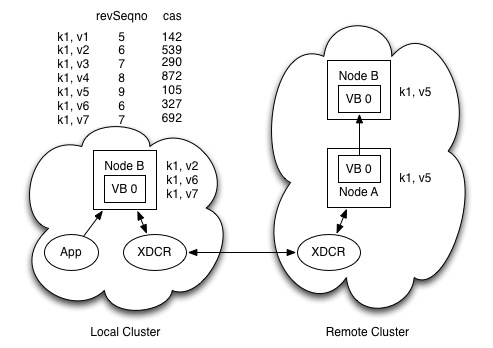
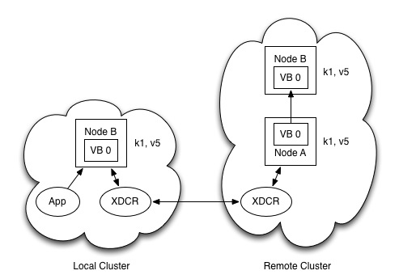

##XDCR-Failover Data Loss Issue

One of the main features of the Couchbase 2.x series is cross data center replication. This feature works by reading items off of disk on the active vbucket and sending them to a remote cluster through the use of front end memcached setMeta/delMeta operations. One issue with the current approach to XDCR is the fact that failovers can cause data to be overwritten when doing any replication that involves a circular dependency. Below we will examine two cases where data can be overwritten when a failover takes place in a cluster that uses XDCR.

Let's take a look at a bi-directional XDCR use case to show how a failover situation can cause data loss. Figure 1 below shows a bi-directional XDCR setup. Both the local and remote cluster each have two nodes and in order to keep the example simple each cluster has 1 VBucket. As a result this means that in each cluster Node A contains the active VBuckt copy and Node B contains the replica VBucket copy. The application for this setup is shown only on the local cluster so this means that the remote cluster will only see incoming mutations through the XDCR stream.

As the application runs it will make updates on the local cluster. Figure 2 shows updates to a specific document k1 over time. Let's say that the application sends five updates to this document (signified in the diagram with kv pairs). These items are quickly persisted to disk and replicated to the remote datacenter through the XDCR stream. Node B on the local cluster however is overloaded and as a result the intra-cluster stream used for replication between Node A and Node B becomes slow. This slowness results in only the second of five updates making it to the replica node in the local cluster even though all of the mutations were streamed to the remote cluster through XDCR.

Shortly after the state shown in Figure 2 is achieved someone kicks the power cord out of Node A on accident and the machine goes down. The power cord being kicked out causes the disk to fail when the power is restored to Node A and as a result the node is failed over. The application traffic resumes to Node B since it becomes the active server and Node B receives two more updates to document k1. When this happens we find ourselves in the state shown in Figure 3 below.

Along with the server state diagram shown above we also show the revision sequence number and cas value for each of the updates that take place to document k1. A clear problem arises when the server is in this state due to the way XDCR conflict resolution works. The current  conflict resolution mechanism first compares the revision sequence numbers. If one document has a high revision sequence number then that document wins. If the revision sequence numbers are the same then the cas value is compared to see which document has a higher cas number. If the cas numbers are the same then this process continues with checks to the expiration time and the flags values. If all of these values are equal then the documents are considered the same.

When the remote cluster sees that the local cluster's document k1 has a lower revision sequence number the remote cluster will overwrite the local clusters document even though the document on the local cluster is actually newer. As a result the cluster ends up in the state shown in Figure 4.

This behavior when failover occurs and there is bi-directional XDCR means that we have a situation that can occur where older data overwrites newer data. The amount of data that can be overwritten is also dependent on how much data is lost due to failover of a node on the local cluster. This means that the loss generally depends on the health of the system at the time of the failover.

One other thing that should be noted is that this situation can occur in the case where a user switches from uni-directional XDCR to bi-directional XDCR. If there were failovers in the local cluster prior to the switch then the behavior discussed in the example above may be seen since the remote cluster might have doucments that contain a high sequence number than their counterpart documents on the local cluster.