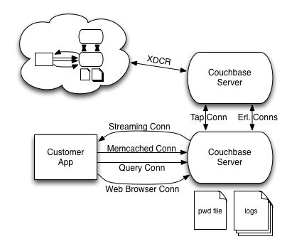

##Couchbase Security Issues

Couchbase has historically been very lax about security. This thinking stems from the fact that memcached, which the server was initially built around did not provide any security mechanisms because the server is run behind firewalls. As a result it is up to the user to implement any needed security mechanisms. Couchbase has also been a performance sensitive system and security mechanisms reduce the amount of throughput and raise the latency of requests as these mecachisms add additional overhead to normal operation.

As Couchbase has matured it has become a more and more viable solution for enterprise customers. For these customers security is very important and in some cases legally required. Access to the data stored in Couchbase must not only be unaccessible to the general public, but must also only be accessable to a select few employees in the company. This means that passwords that allow users to access the data must be protected when being store an disk and sent over the wire. Customers should also have the option to encrypt data that is sent over the wire by applications since some of the data store in Couchbase might be confidential information.

This document intends to shed light on some of the major areas of concern are around Couchbase security so that steps can be taken to make the server more secure. It should also be noted that in all instances it should be up to the user how secure or not secure they want their communications to be. All of these mechanisms should be configurable and optional so that the user can decide the level of security they need for their application.

The diagram above shows a series of connections that may or may not be used in a typical customer instalation. It also shows some on disk storage files that consist of a password file and some logs. As mentioned above Couchbase currently provides no security mechanisms to protect data and passowrds. Below we will examine all places where security can be improved based on order of importance.

1. Logs - Couchbase log files can potentially contain password information and is something that is considered embarassing on our part. Two known places where passwords can appear in the logs are the output of the cbcollectinfo script and the ns_server diags. The cbcollectinfo script collects server statistics and prints out the command that is used to grab that data. Since the password is part of the command this information is added to the output of this command. The ns_server diags are another place that passwords can appear. The diags consist of erlang processes dumps and these crashed processes may have passwords in their state which will be written to the log file. Since these log files may be given to Couchbase support or to the customers employees for debugging we need to make sure that they do not contain passwords or other sensitive information.

2. XDCR Connections - Our XDCR module currently contains no security mechanisms and this poses a huge security risk because both data and passwords are sent over the internet. This means that an attacker does not even need access to a customers datacenter in order to sniff packets off the wire. In order to secure XDCR traffic we will need to add an SSL/TLS layer in order to protect this information. The current customer workaround is to tunnel XDCR traffic through a VPN connection, but this adds extra overhead which can be avoided with the proper security mechanisms in place.

3. Web Browser Connections - When a user connects through the Admin Console they do so through an insecure connection. Anyone with access to a customers network would easily be able to sniff packets off the network in order to discover admin console passwords. Another issue is that we also store admin console passwords in plain text in cookies in the browser of anyone who accesses the admin console. This means that if someone had access to an employees computer who had recently accessed the Couchbase Admin Console then they could easily look at the stored cookies in order to obtain Admin Console passwords.

4. Memcached/Tap Connections - Couchbases Memcached connections currently support SASL authentication in order to gain access to a specific database. Unfortunately, we only support PLAIN SASL authentication which means that passwords are sent in clear text over the network. Another issue is that memcached connections do not have the ability to encrypt data that is sent over the network either. Adding DIGEST-MD5 and TLS support would aleviate this issue.

5. Query Connection - The client connection to Couchabse that is used for queries runs over HTTP and currently does not allow for the use of SSL/TLS. While CouchDB does support these security mechanisms they have never been turned on. Securing queries and their results will be important moving forward.

6. Streaming Connection - Couchbase currently provides a streaming connection that sends topology changes and other state information to clients so that they can update routing paths in the event of failures or topology changes in a cluster. This streaming api will need to be passoword protected and have it's data encrypted so that attackers cannot gain information about the current state of the cluster.

7. PWD Files - Couchbase currently stores passwords in plain text on the disk. These passwords should be encrypted as well so that people with access to a system running Couchbase cannot access these passwords.

8. Erlang Connections - Erlang uses a series of ports for communication. A fully secure server will also need to protect the data that is transmitted over these ports.

On important thing to note is that security will not be a concern for all customers. Some will want to use every security mechanism possible, some will want to use a few of them, and some will not want to use any. All of these features should be configurable and a sane default should be set that provides a good balance between performance and security.